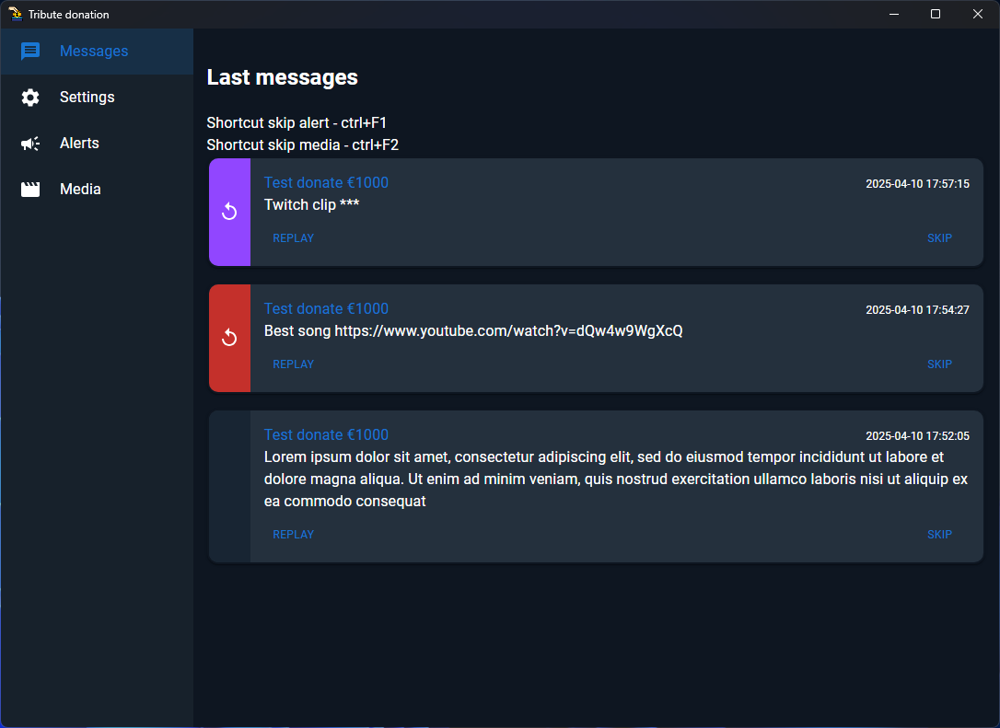

# Tribute Donation

Parser of donation messages from tribute bot and displaying them in obs.

## Screenshot

Here’s a preview of the application:




## Development

### Prerequisites
Ensure you have the following installed on your system:
- [Node.js](https://nodejs.org/) (LTS version recommended)
- [Rust](https://www.rust-lang.org/tools/install)

To install and run the project locally, follow these steps:

1. Clone the repository:
   ```
   git clone https://github.com/ik1s3v/tribute-donation.git
   cd tribute-donation
   ```

2. Install dependencies:
   ```
   npm install
   ```

3. Start the development:
   ```
   npm run tauri dev
   npm run widget:dev
   ```

## Build

To build the project for production, use the following commands:

For build you need set environment variables API_ID, API_HASH (take it from https://my.telegram.org/) and TAURI_SIGNING_PRIVATE_KEY (take it from Cargo.toml)

To set environment variables on Windows, follow these steps:

1. Open PowerShell.
2. Enter the following commands:
   ```
   $env:API_ID="your_api_id"
   $env:API_HASH="your_api_hash"
   $env:TAURI_SIGNING_PRIVATE_KEY="your_private_key"
   ```
   
   Replace `your_api_id`,`your_telegram_chanel_id_for_test`, `your_api_hash`, and `your_private_key` with the actual values.

3. Build the Tauri application:
   ```
   npm run build:production
   ```

The production-ready files will be available in the `src-tauri/target/release` directory.

## License
This project is licensed under the [MIT License](LICENSE).

## Contact
For questions or feedback, please contact Discord ik1s3v.